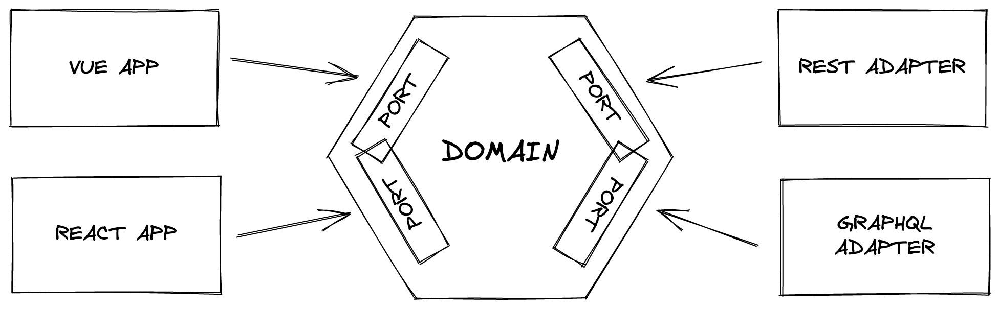

# Frontend Hexagonal architecture

The goal of this project is to apply the hexagonal architecture on frontend applications.

## Why ?

Having business logic in UI components is a problem.

The front-end business code is strongly linked to the UI framework (JS) used, which makes difficult the migration to a new framework.

**Use case :**

The AngularJS deprecated apps which needs to be migrated to current frameworks.

The more business code the application has in UI components, the harder it is to migrate it to a new framework

## How ?

The hexagonal architecture is used to isolate the code of the business application in a layer named domain and represented as an hexagon.

- The domain is agnostic and contains only native code without framework
- The domain has ports on left and ride side
- Left port called API (Application Programming Interface) is the domain entrypoint interface signature used by the exposition layer
- Right port called SPI (Service Providing Interface) is the domain adapter interface used to inject the adapter layer which access to the data

**In our case :**
- Left side will be the UI Framework (VueJS, React ...)
- Right side will be the API client (REST, GraphQL...)



## Project structure

This demo application is a monorepo based on pnpm workspace.
- Front apps are available in the [apps](./apps/) directory
- Business domain is available in the [packages/domain](./packages/domain/) directory
- Adapters are available in the [packages/adapters](./packages/adapters) directory

## Install

```sh
pnpm install
```

## Build TS modules and Web components

```sh
pnpm build
```

## Run demo application

Run command 

```
pnpm rundemo
```

Click on the console displayed link : 

```sh
 VITE v3.0.3  ready in 160 ms

  ➜  Local:   http://localhost:5173/
  ➜  Network: use --host to expose
```

You can use demo existing users or create a new one.

(user / password) 
- unicorn / rainbow
- doe-j / test1234
- josue.emmerich / secret

## Useful links
- (EN) https://alistair.cockburn.us/hexagonal-architecture/
- (FR) https://beyondxscratch.com/fr/2018/09/11/architecture-hexagonale-le-guide-pratique-pour-une-clean-architecture/
- (FR) https://blog.octo.com/architecture-hexagonale-trois-principes-et-un-exemple-dimplementation/
- (FR) https://www.youtube.com/watch?v=dtP-tTHjckE