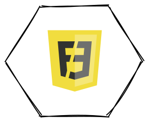
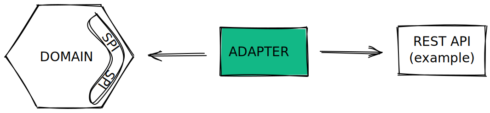
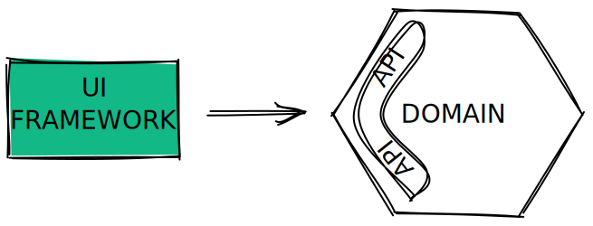
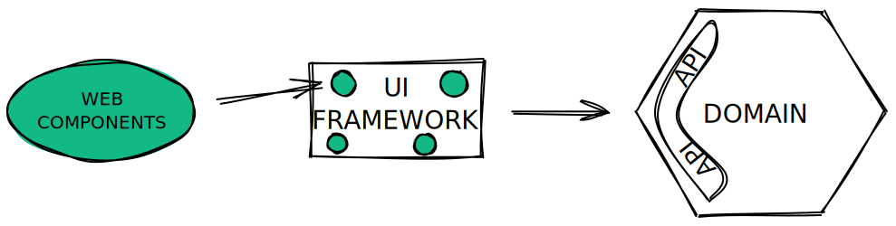

# **Architecture frontend**

L'architecture hexagonale comme solution à l'obsolescence des frameworks UI

---

# Remerciements

- Simon pour son aide sur la partie style et les web components
- Julien Topçu qui nous a conseillé sur la partie architecture hexagonale et qui a répondu à nos questions tout au long du projet

---

# Constat

Aujourd’hui la majorité des applications frontend sont produites à l'aide de frameworks.

Les trois principaux frameworks du marché sont React, VueJS et Angular.

Les frameworks UI permettent de développer plus rapidement les applications. Ils gèrent nativement la réactivité ainsi que la compatibilité des applications avec les différents navigateurs.

---

# Problématiques

Tout le code dédié à la partie métier frontend va généralement se retrouver également lié au fonctionnement du framework.

Lorsqu'un framework devient déprécié (ex: AngularJS), il faut de nouveau réécrire toute l'application dans un nouveau framework.

---

# Comment l'éviter ?

Pour éviter de tomber dans ce genre de piège, il faut chercher à décorréler la partie métier frontend de la partie UI / Framework.

L'idée est d'avoir un framework en charge uniquement du rendu html et de la réactivité des composants.

---

# L'architecture hexagonale au service du frontend

Voici un exemple de découpage d’application frontend utilisant l'architecture hexagonale :

---

# Etape 1 - Identifier son métier

Notre application est un Twitter simplifié qui possède les fonctionnalités suivantes :
- Création de compte / Authentification
- Publication de tweets
- Récupération des tweets
- Like

Ce sont ces fonctionnalités qui représentent notre métier front. 
Peu importe le framework, elles ne changeront pas.

--- 

# Etape 2 - Tester son domaine métier

Maintenant que nous avons un domaine métier étanche, nous pouvons le couvrir via des tests unitaires métier.

Cette organisation permet également de développer naturellement la partie métier en TDD ce qui d'ailleurs est recommandé.

---

# Etape 3 - Accès à la donnée (adapters)

Cette couche va avoir pour responsabilité d'interagir avec la donnée, généralement via des appels à des API pour des applications frontend.

---

# Etape 4 - Utilisation du domaine

Une fois le domaine et la couche adapter en place, il est maintenant possible de brancher le domaine dans notre application UI réalisée avec le framework de notre choix.

---

# Etape 5 - Web components

Les web components permettent de créer des composants web personnalisés et réutilisables.

Ils sont également compatible avec tous les framework UI ce qui peut être intéressant pour limiter encore plus l'adhérence avec le framework.

---

# Etape 6 - Tests end-to-end (E2E)

Nous avons maintenant le métier isolé dans le domaine et une application UI qui est capable de fonctionner avec des stubs (bouchons).

Grâce à ça, nous pouvons facilement réaliser des tests end-to-end (E2E) de notre application pour tester le rendu de nos UI et ça sans avoir besoin de l'application backend associée.

---

# Conclusion

La mise en pratique de l'architecture hexagonale côté frontend permet de construire des applications durables dont le métier pourra perdurer même après dépréciation d'un framework UI.

Cette architecture met en place une collaboration PO / Devs pour la construction du domaine métier.

Les développeurs backend peuvent participer au développement frontend sur la partie domaine et adapter qui reste identique à du JS back.

