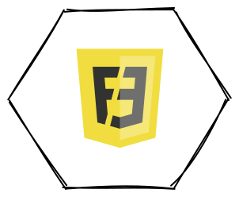
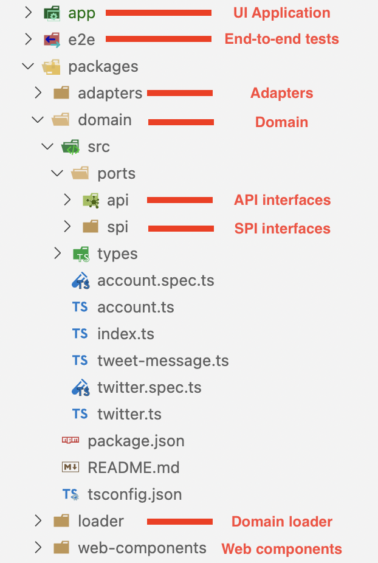

# **Architecture frontend**

L'architecture hexagonale comme solution à l'obsolescence des frameworks UI

---

# Remerciements

- Simon pour son aide sur la partie style et les web components
- Julien Topçu qui nous a conseillé sur la partie architecture hexagonale et qui a répondu à nos questions tout au long du projet

---

# Constat

Aujourd’hui la majorité des applications frontend sont produites à l'aide de frameworks.

Les trois principaux frameworks du marché sont React, VueJS et Angular.

Les frameworks UI permettent de développer plus rapidement les applications. Ils gèrent nativement la réactivité ainsi que la compatibilité des applications avec les différents navigateurs.

---

# Problématiques

Tout le code dédié à la partie métier frontend va généralement se retrouver également lié au fonctionnement du framework.

Lorsqu'un framework devient déprécié (ex: AngularJS), il faut de nouveau réécrire toute l'application dans un nouveau framework.

---

# Comment l'éviter ?

Pour éviter de tomber dans ce genre de piège, il faut chercher à décorréler la partie métier frontend de la partie UI / Framework.

L'idée est d'avoir un framework en charge uniquement du rendu html et de la réactivité des composants.

---

# L'architecture hexagonale au service du frontend

Voici un exemple de découpage d’application frontend utilisant l'architecture hexagonale :

---

# Etape 0 - Projet de départ

Les différentes étapes à suivre se baseront sur la migration d'une app legacy AngularJS vers un modèle hexagonal.

https://gitlab.com/thekitchen/frontend-legacy-app

---

# Etape 1 - Identifier son métier

Notre application est un Twitter simplifié qui possède les fonctionnalités suivantes :
- Création de compte / Authentification
- Publication de tweets
- Récupération des tweets
- Like

Ce sont ces fonctionnalités qui représentent notre métier front. 
Peu importe le framework, elles ne changeront pas.

---

# Etape 2.1 - Ports SPI

La couche SPI (Service Provider Interface) contient toutes les interfaces requises et fournies par le domaine pour interagir avec la donnée.

C'est ici que nous allons définir les interfaces permettant au domaine de récupérer / créer des tweets, s'authentifier etc... 

---

# Etape 2.2 - Ports API

La couche API contient toutes les interfaces permettant de communiquer avec le domaine métier.
Comme pour la SPI, les interfaces sont fournies par l'hexagone.

C'est cette couche qui va permettre à un framework UI d'implémenter la communication avec le domaine.

--- 

# Etape 3 - Tester son domaine métier

Maintenant que nous avons un domaine métier étanche, nous pouvons le couvrir via des tests unitaires métier.
La partie SPI pourra facilement être remplacée par des stubs qui retourneront de la donnée en dur.

Cette organisation permet également de développer naturellement la partie métier en TDD ce qui d'ailleurs est recommandé.

---

# Etape 4 - Accès à la donnée (adapters)

La couche adapter de notre hexagone implémente les interfaces de type SPI.

Cette couche va avoir pour responsabilité d'interagir avec la donnée, généralement via des appels à des API (REST, GraphQL, etc...) pour des applications frontend.

---

# Etape 5 - Chargement de l'hexagone

L'architecture hexagonale utilise le principe de l'injection de dépendances pour monter les différentes couches.

Le domaine reçoit une instance de chaque adapter qu'il doit utiliser etc...

Pour cela, nous recommandons la mise en place d'une couche de type "loader" qui se chargera d'instancier et d'injecter les différentes couches.

---

# Etape 6 - Brancher le domaine dans le framework

Une fois le domaine et la couche adapter en place, il est maintenant possible de brancher le domaine dans notre application UI réalisée avec le framework de notre choix.

---

# Etape 7 - Web components

Les web components permettent de créer des composants web personnalisés et réutilisables.

Ils sont également compatible avec tous les framework UI ce qui peut être intéressant pour limiter encore plus l'adhérence avec le framework.

---

# Etape 8 - Tests E2E

Nous avons maintenant le métier isolé dans le domaine et une application UI qui est capable de fonctionner avec des stubs.

Grâce à ça, nous pouvons facilement réaliser des tests end-to-end (E2E) de notre application pour tester le rendu de nos UI et ça sans avoir besoin de l'application backend associée.

---

# Projet final

Voici la structure finale du projet une fois la migration vers une architecture hexagonale terminée.

---

# Démo

https://gitlab.com/thekitchen/frontend-hexagonal-demo

---

# Conclusion

La mise en pratique de l'architecture hexagonale côté frontend permet de construire des applications durables dont le métier pourra perdurer même après dépréciation d'un framework UI.

Avec ce découpage, les développeurs backend peuvent participer au développement frontend sur la partie domaine et adapter qui reste identique à du JS back.

L'application devient testable sans backend et en mémoire grâce à l'utilisation des stubs.

---

# Pour aller plus loin

Il est possible d'aller encore plus loin dans le découpage de l'application et le cloisonnement du framework :
- Isolation de la partie CSS dans un package dédié (dépend de l'utilisation de framework CSS ou non)
- Isoler la configuration de bundling (ex: ViteJS qui est compatible avec les principaux framework)
- Mettre en place du micro frontend (le découpage permet de brancher n'importe quel framework sur le domaine métier).